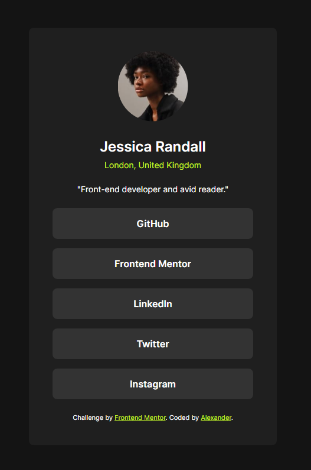

# Frontend Mentor - Social links profile solution

This is a solution to the [Social links profile challenge on Frontend Mentor](https://www.frontendmentor.io/challenges/social-links-profile-UG32l9m6dQ). Frontend Mentor challenges help you improve your coding skills by building realistic projects. 

## Table of contents

- [Overview](#overview)
  - [The challenge](#the-challenge)
  - [Screenshot](#screenshot)
  - [Links](#links)
  - [Built with](#built-with)
- [Author](#author)

**Note: Delete this note and update the table of contents based on what sections you keep.**

## Overview

### The challenge

Social links profile solution

### Screenshot

### Links

[Solution URL](https://your-solution-url.com)
[Live Site URL](https://your-live-site-url.com)

### Built with

- Semantic HTML5 markup
- CSS Grid

## Author

- Github - [Alexander](https://github.com/sthefano-dev)
- Frontend Mentor - [@sthefano-dev](https://www.frontendmentor.io/profile/sthefano-dev)
